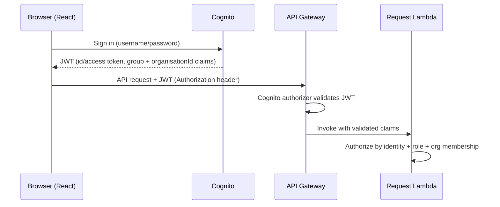
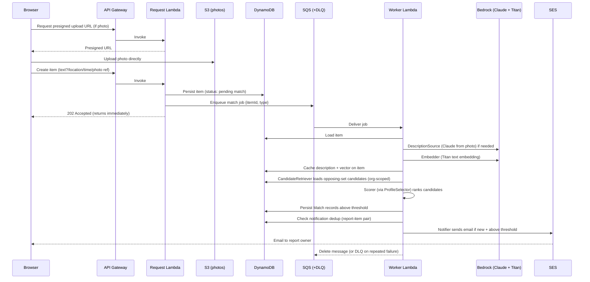
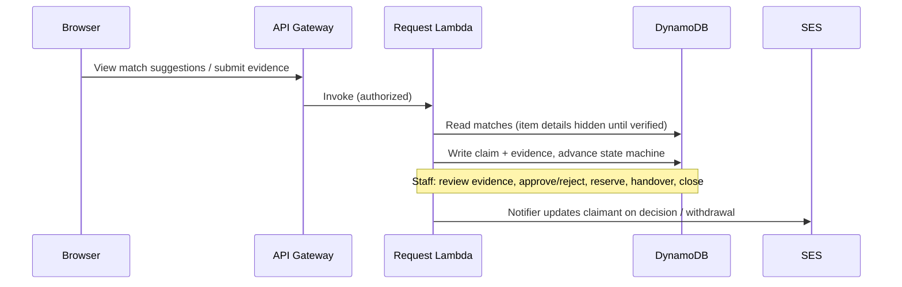
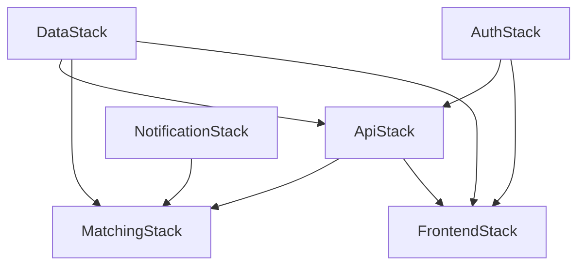
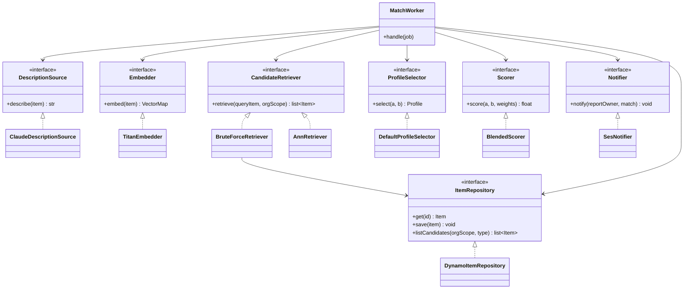
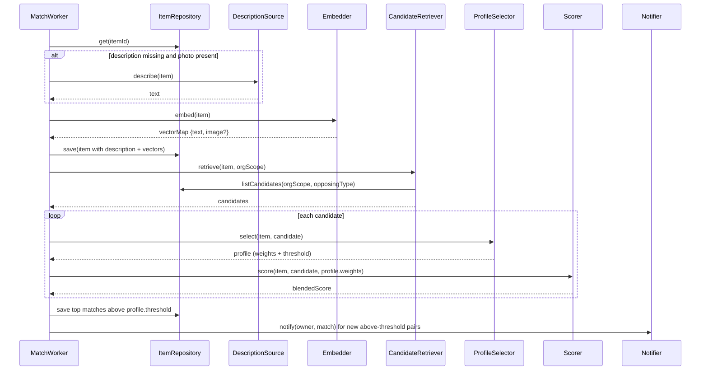
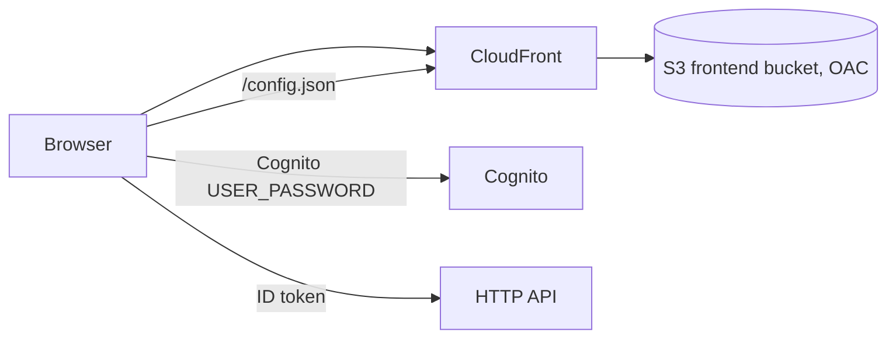
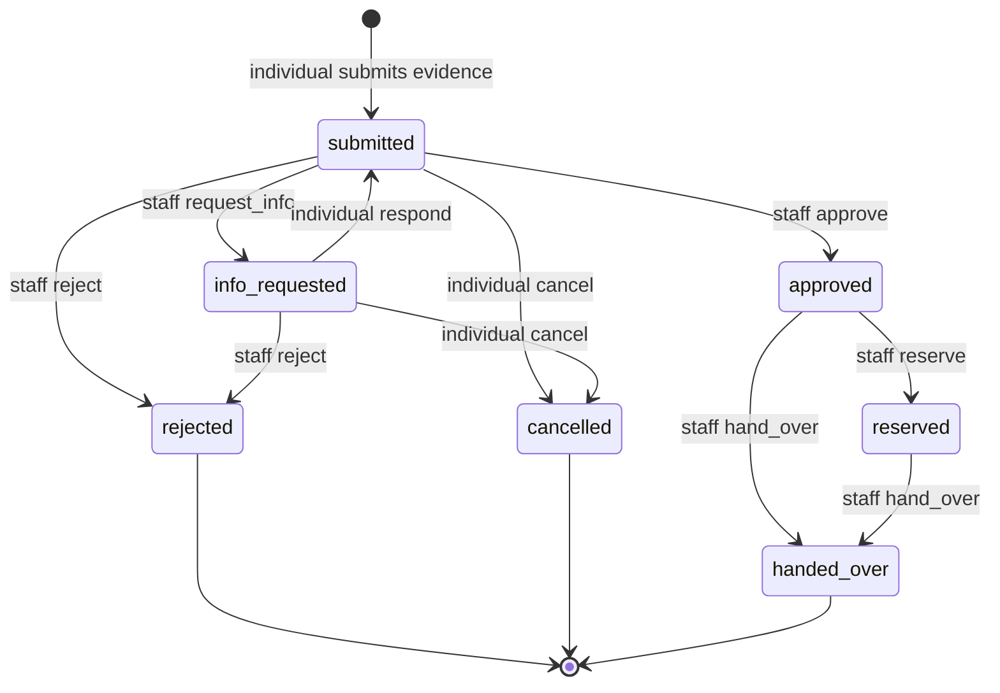

# LostLink — Component Interactions

> How the pieces talk to each other, at two levels: the **architecture level** (AWS
> services and request/data flows) and the **class level** (the backend pipeline
> interfaces and how they call each other). Keep this current whenever a component or
> interaction changes.

---

## 1. Architecture level

### 1.1 Authentication flow

### 1.2 Write + async matching flow (report or found item submitted)

### 1.3 Read / claims flow

### 1.4 CDK stack dependency graph

Each arrow is a CDK cross-stack reference (an exported ARN/name consumed by the
dependent):
- **ApiStack** needs the Cognito pool (Auth) and tables/buckets (Data).
- **MatchingStack** needs the queue trigger and tables (Data), SES permissions
  (Notification), and shares the pipeline code.
- **FrontendStack** needs the API URL, Cognito IDs, and the hosting bucket.

---

## 2. Class level (backend pipeline)

The worker orchestrates stage **interfaces**. Each has one concrete implementation
now; an `AnnRetriever` is stubbed for the future. The orchestrator depends only on
interfaces, so implementations swap freely (selected via environment variables where a
future swap is anticipated).

### 2.1 Worker orchestration sequence (one job)

### 2.2 Interaction contracts (the seams that make swaps safe)

- **Embedder** returns a named `VectorMap` (`{text: [...], image: None}` today).
  Adding image embeddings later fills the `image` slot; no other class changes.
- **CandidateRetriever** returns candidates only; it never scores. Swapping
  `BruteForceRetriever` → `AnnRetriever` changes *which* candidates arrive, not *how*
  they are scored.
- **Scorer** is pure: same inputs → same output, no AWS or retrieval knowledge. The
  evaluation harness calls this exact class.
- **ProfileSelector** centralises weight/threshold choice; the single-profile-today
  decision lives here, and multi-profile returns just change this class.
- **Notifier** hides the channel; SES today, other channels later.
- **ItemRepository** hides DynamoDB; storage changes stay behind it.
- **MatchWorker** depends only on interfaces, wired at startup from environment
  variables (e.g. `RETRIEVER=bruteforce`), so implementations are chosen by config.

---

## 3. Data model (DynamoDB + S3)

Multi-table design (see RATIONALE ADR-012). The organisation id is a key component so
staff-scoped access cannot cross the org boundary at the data layer.

### 3.1 Items table (`LostLink-Items`) — lost reports AND found items

- **PK:** `itemId`
- Attributes: `itemType` (`lost`|`found`), `organisationId`, `ownerId`, `status`,
  `createdAt`, `orgType` (`<orgId>#<type>`, derived), `description`, `locationZone`,
  `eventTime`, `photoKey`, `vecText` (JSON), `vecImage` (JSON, reserved).
- **GSIs:**
  - `by-owner` (PK `ownerId`, SK `createdAt`) — an individual lists their own reports.
  - `by-org-type` (PK `orgType`, SK `createdAt`) — staff list/search their org's
    inventory; the org is baked into the PK so the query cannot escape the org.
  - `by-type` (PK `itemType`, SK `createdAt`) — cross-org candidate retrieval used by
    the matching worker (`BruteForceRetriever` queries all `found` / all `lost`).

### 3.2 Claims table (`LostLink-Claims`)

- **PK:** `claimId`. GSIs: `by-owner` (PK `claimantId`) for a claimant's claims,
  `by-org-type` (PK `organisationId`) for staff review. Built out in Tasks 11-12.

### 3.3 Matches table (`LostLink-Matches`)

- **PK:** `queryItemId` (lost report), **SK:** `candidateItemId` (found item).
- Attributes: `organisationId`, `score`, `profileName`, `breakdown`, `notified`
  (per-pair dedup flag, Task 10), `createdAt`.

### 3.4 Organisations table (`LostLink-Organisations`)

- **PK:** `organisationId`.

### 3.5 S3 buckets

- `lostlink-photos-<account>` — private; browser upload/download via **presigned URLs**
  generated against the regional endpoint with SigV4 (avoids the 307 redirect new
  buckets return outside us-east-1). CORS allows PUT/GET/HEAD.
- `lostlink-frontend-<account>` — static hosting for the React app (CloudFront in
  Task 6).

### 3.6 Mapping layer

`backend/pipeline/impl/ddb_mapping.py` is the single canonical encoder between the
`Item`/`MatchResult` dataclasses and the DynamoDB shape (vectors stored as JSON
strings; floats stored as `Decimal`). Both the repository and the request Lambdas use
it. `DynamoItemRepository` reads `ITEMS_TABLE` / `MATCHES_TABLE` from the environment.

## 3.7 HTTP API and request handlers

API Gateway **HTTP API v2** with a Cognito **JWT authorizer** (validates the ID token,
passes claims to Lambdas). Handlers live in `backend/api/` and share three helpers:

- `auth.py` — `principal_from_event()` builds a `Principal` (user_id=`sub`, email,
  groups from `cognito:groups`, org from `custom:organisationId`) **only** from the
  validated authorizer claims. `require_individual()`/`require_staff()` gate routes.
  Role and org are never taken from the request body — this is the privacy core.
- `responses.py` — JSON responses (Decimal-safe), body/route parsing, CORS.
- `s3urls.py` — presigned PUT/GET using the regional endpoint + SigV4 (307 fix).

Routes added in Task 4 (individual reporting), all authorized:

| Method | Path | Purpose |
|--------|------|---------|
| POST | `/uploads` | presigned S3 PUT url for a photo |
| POST | `/reports` | create a lost report (text+location required, photo optional) |
| GET | `/reports` | list caller's own reports (by-owner GSI) |
| GET | `/reports/{itemId}` | get one own report (403 if not owner) |
| PATCH | `/reports/{itemId}` | edit; resets embeddings + status to pending_match |
| DELETE | `/reports/{itemId}` | withdraw |

Routes added in Task 5 (staff inventory), all authorized and Staff-group-gated:

| Method | Path | Purpose |
|--------|------|---------|
| POST | `/items/uploads` | presigned S3 PUT url for a found-item photo |
| POST | `/items` | register a found item (org from token; photo-first) |
| GET | `/items` | list/search caller's ORG inventory (`?q=`, `?status=`) |
| GET | `/items/{itemId}` | get one found item (403 if not caller's org) |
| PATCH | `/items/{itemId}` | update a found item in caller's org |
| DELETE | `/items/{itemId}` | withdraw a found item in caller's org |

The staff handler takes `organisationId` from the token (`custom:organisationId`), never
from the request, and `_load_in_org` rejects access to another org's item with 403. The
org boundary is thus enforced twice: in the GSI key design (data layer) and in the
handler (application layer).

`ApiStack` exposes `httpApi` + `authorizer` so Tasks 11-12 (claims) add routes to the
same API. On create/edit both handlers enqueue a match job to `MATCH_QUEUE_URL` when set
(wired in Task 8).

## 3.8 Frontend (React SPA on CloudFront)

React (Vite) SPA, pragmatic by design — the one clean seam is `api.ts` (the ApiClient).

- `config.ts` — fetches `/config.json` at startup (apiUrl, region, userPoolId,
  userPoolClientId). Not baked into the build, so one bundle works for any deployment.
- `auth.ts` — `amazon-cognito-identity-js` USER_PASSWORD flow; decodes `cognito:groups`
  and `custom:organisationId` from the ID token.
- `api.ts` — the ApiClient: attaches the ID token to every call; wraps report + item
  endpoints; handles presigned photo upload (POST /uploads or /items/uploads → PUT).
- `App.tsx` — loads config, restores session, role-gates on `cognito:groups` to render
  the Individual or Staff portal.
- Portals: `IndividualPortal` (report form + my reports + withdraw), `StaffPortal`
  (register found item photo-first + inventory search + withdraw).

Hosting: `FrontendStack` owns a private S3 bucket + CloudFront (Origin Access Control).
A `BucketDeployment` uploads `frontend/dist` and a generated `config.json` from the
deployed stack outputs, then invalidates the CDN. SPA deep links fall back to
index.html via 403/404 → 200 responses.

## 3.9 Claims workflow

A **claim** links a lost report to a found item (a surfaced match) and moves through an
explicit state machine (`backend/api/claim_state.py`), shared by the individual (Task 11)
and staff (Task 12) sides so neither can perform an invalid transition.

Individual routes (Task 11), all authorized + Individual-gated:

| Method | Path | Purpose |
|--------|------|---------|
| GET | `/matches` | my match suggestions — score + org only, **found details hidden** |
| POST | `/claims/uploads` | presigned URL for an evidence file |
| POST | `/claims` | submit a claim (ownership evidence) for a surfaced match |
| GET | `/claims` | my claims + status |
| GET | `/claims/{claimId}` | one of my claims (found details only once approved) |
| POST | `/claims/{claimId}/respond` | answer a staff info request / add evidence |
| POST | `/claims/{claimId}/cancel` | withdraw a claim |

**Privacy gate:** `claim_state.details_visible(state)` is true only for approved /
reserved / handed_over. Every claimant-facing response (`/matches`, `/claims`,
`/claims/{id}`) omits the found item's description and photo until then — the claimant
sees only that a partner organisation may hold their item.

Staff routes (Task 12), all authorized + Staff-gated + org-scoped (a staff member can only
see/act on claims against `custom:organisationId`):

| Method | Path | Purpose |
|--------|------|---------|
| GET | `/org/claims` | claims against my org (full claimant evidence visible) |
| GET | `/org/claims/{claimId}` | one claim + messages + the found item |
| POST | `/org/claims/{claimId}/request-info` | ask the claimant for more info |
| POST | `/org/claims/{claimId}/approve` | confirm ownership (opens the privacy gate) |
| POST | `/org/claims/{claimId}/reject` | reject the claim |
| POST | `/org/claims/{claimId}/reserve` | reserve item (found status → reserved) |
| POST | `/org/claims/{claimId}/handover` | record handover (found status → closed) |

Each staff decision emails the claimant (privacy-safe, no item details). Withdrawing a
found item (`DELETE /items/{id}`) rejects any active claims on it and notifies those
claimants (`notify_withdrawn_claims`). Item status flows available → reserved → closed
across the approval lifecycle, so a reserved/handed-over item is not re-matched.

## 4. Status of interfaces vs implementations

| Interface | Implementation(s) | State |
|-----------|-------------------|-------|
| DescriptionSource | ClaudeDescriptionSource | **built (Task 7)** — live-verified (Claude vision, `au.` profile) |
| Embedder | TitanEmbedder | **built (Task 7)** — live-verified (Titan text v2, 1024-dim) |
| CandidateRetriever | BruteForceRetriever / AnnRetriever(stub) | **built (Task 8)** — BruteForce live-verified; Ann stub |
| Scorer | BlendedScorer | **built + hardened (Task 8/9)** — pure (no boto3, proven), 15 tests |
| ProfileSelector | DefaultProfileSelector | **built + tested (Task 8/9)** — env-driven single profile; multi-profile hook reserved |
| Notifier | SesNotifier | **built (Task 10)** — SES send + conditional-update dedup; dedup live-verified |
| ItemRepository | DynamoItemRepository | **built (Task 3)** — live-verified |

_Update this table as each implementation lands._
