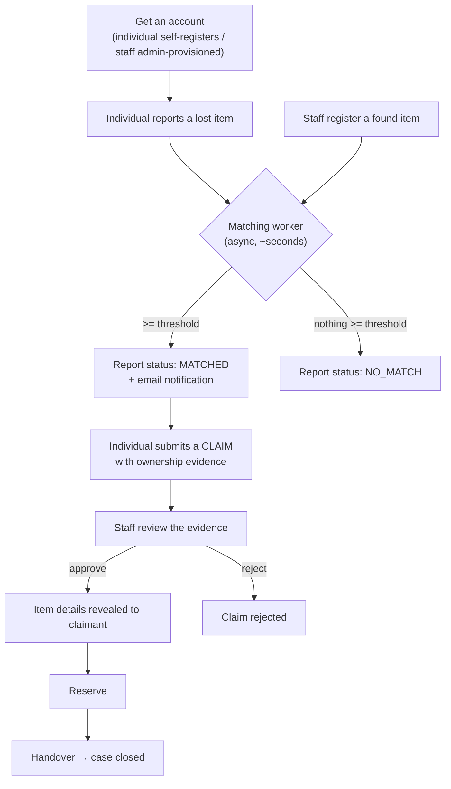
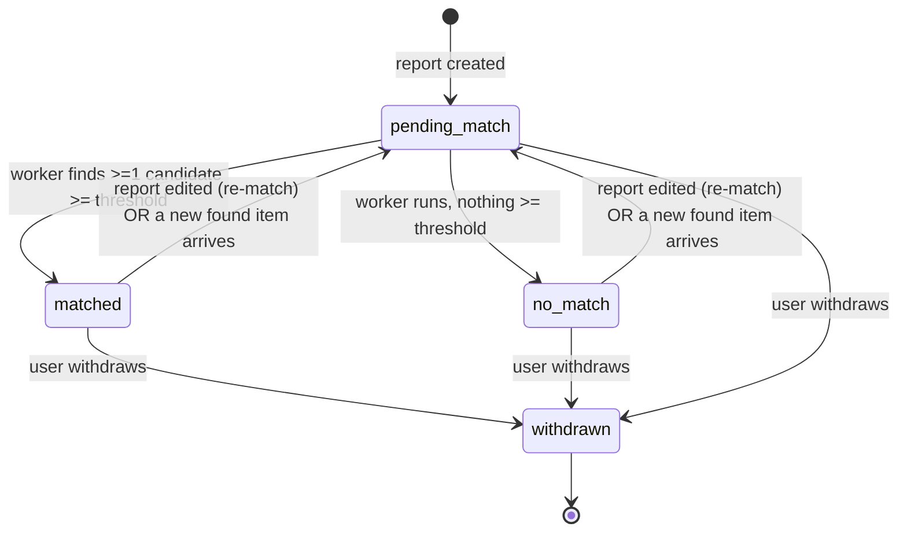
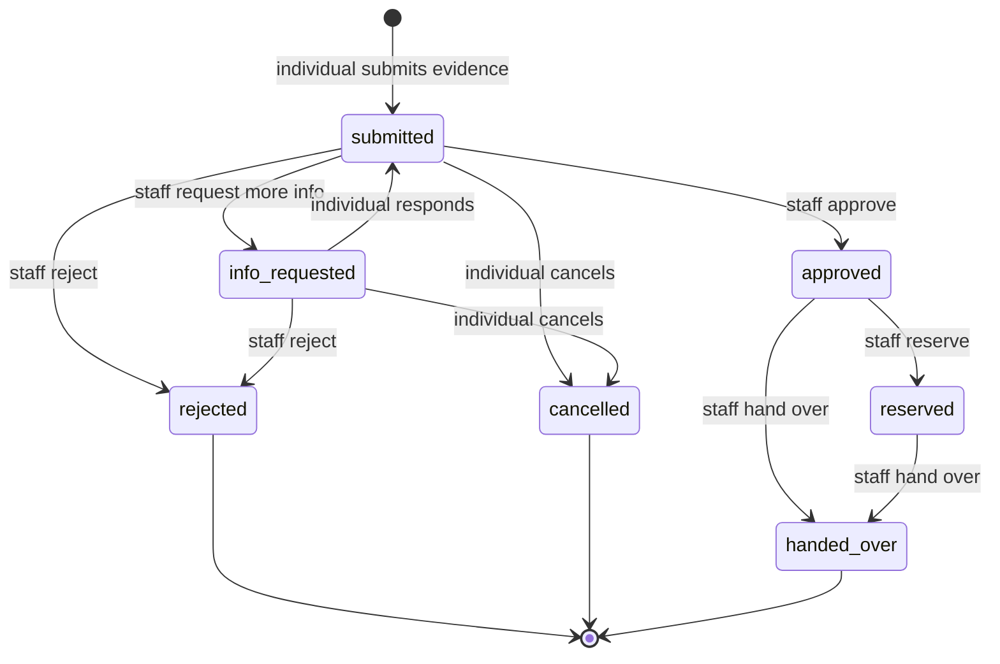

# LostLink — End-to-End Flow

The single reference for how LostLink works, from signing up to a verified handover. It
covers every major flow and links to a focused per-flow doc for each one.

This document is the overview + the two user-facing lifecycles (report status and claim).
For the deep detail of each subsystem — exact code, files, and how to change it — follow
the links.

| Flow | Deep-dive doc | What it covers |
|------|---------------|----------------|
| Authentication | [`flows/authentication.md`](flows/authentication.md) | Register, confirm, login, token claims, post-confirmation role trigger |
| Organisation & access | [`flows/organisation-access.md`](flows/organisation-access.md) | Role/org model, the access boundary, who-sees-what, cross-org vs scoped |
| Matching | [`flows/matching.md`](flows/matching.md) | Async pipeline, swappable stages, scoring math, how to tune |
| Notification | [`flows/notification.md`](flows/notification.md) | SES emails, exactly-once dedup, best-effort decoupling |
| Decision & status | [`flows/decision-and-status.md`](flows/decision-and-status.md) | Report status + claim state machine + privacy gate |

Supporting docs: `ARCHITECTURE.md` (component/class interactions), `RATIONALE.md` (design
decisions / ADRs), `RUNBOOK.md` (deploy + operate).

---

## 1. The whole journey at a glance



Two actors, two artefacts:

- **Individual** owns a **lost report** (one item they lost). Self-registers for an account.
- **Staff** own **found items** (their organisation's inventory) and **review claims**.
  Provisioned by an admin, bound to one organisation.
- A **match** links a lost report to a found item. A **claim** is an individual's attempt
  to prove a matched found item is theirs.

The five flows map onto this journey like so: **authentication** gets you in →
**matching** connects lost and found → **decision & status** tracks where each thing is →
**notification** tells you when something changes → **organisation & access** governs what
each person is allowed to see throughout.

---

## 2. Getting an account (summary)

- **Individuals self-register**: login screen → "Create an account" → email + password →
  Cognito emails a code → confirm → signed in. A post-confirmation Lambda assigns the
  `Individual` role automatically.
- **Staff are admin-provisioned** with an organisation id and the `Staff` role.

Role is Cognito **group membership** (`cognito:groups`); org is the `custom:organisationId`
claim. Full detail: [`flows/authentication.md`](flows/authentication.md).

---

## 3. Matching (summary)

Submitting a report writes the item and enqueues an async job; a worker Lambda enriches it
(Claude description if photo-only, Titan embedding), retrieves opposing-type items across
**all** organisations, and scores each pair:

```
score = 0.6·textSim + 0.25·spatialSim + 0.15·temporalSim   (image reserved, 0 today)
```

Pairs scoring **≥ 0.70** are persisted as matches and surfaced. The threshold is the
visibility gate — a user only ever sees matches that already cleared it, each with its
confidence score. Full detail incl. the scoring math and tuning:
[`flows/matching.md`](flows/matching.md).

---

## 4. Lost-report status lifecycle

A lost report has exactly these statuses. Only the matching worker (and withdraw) change
them.



| Status | Meaning | UI label |
|--------|---------|----------|
| `pending_match` | Created but the worker hasn't finished processing it yet | "searching…" |
| `matched` | The worker found at least one found item above the score threshold | "match found" |
| `no_match` | The worker ran and found nothing above the threshold **yet** | "no match yet" |
| `withdrawn` | The user withdrew the report | "withdrawn" |

Key points:
- `no_match` is **not** permanent. When a new found item is registered later, the worker
  re-runs and can flip a report to `matched` (and email the owner).
- Editing a report clears its embeddings and sets it back to `pending_match`.
- `pending_match` is transient — the worker usually advances it within seconds.

Found items carry their own claims-driven status: `available` → `reserved` → `closed`
(plus `withdrawn`).

---

## 5. Claim status lifecycle (7 states)

A claim exists only **after** a report is `matched` and the user acts on a surfaced match.
Transitions are enforced by the shared state machine (`backend/api/claim_state.py`); each
side can only perform its own transitions.



| State | Set by | Meaning |
|-------|--------|---------|
| `submitted` | individual | Evidence submitted; awaiting staff review |
| `info_requested` | staff | Staff asked for more info; claimant must respond |
| `approved` | staff | Ownership confirmed — **item details now revealed to claimant** |
| `rejected` | staff | Claim denied (terminal) |
| `reserved` | staff | Approved item set aside for collection (found item → `reserved`) |
| `handed_over` | staff | Physical handover recorded (found item → `closed`; terminal) |
| `cancelled` | individual | Claimant withdrew the claim (terminal) |

Withdrawing a found item rejects any active claims on it and notifies those claimants. Full
transition table + how to extend: [`flows/decision-and-status.md`](flows/decision-and-status.md).

---

## 6. The privacy gate (the product's core promise)

Item details are hidden from the claimant until ownership is verified.

- In **potential matches** and in a claim that is `submitted` / `info_requested`, the
  individual sees only: a message that a partner organisation may hold their item, the
  organisation, and the confidence score. **No description, no photo.**
- Only once the claim reaches `approved` (or `reserved` / `handed_over`) are the found
  item's description, location and photo revealed, along with collection instructions.
- Enforced server-side by `claim_state.details_visible(state)` on every claimant-facing
  response — not just hidden in the UI.

Staff always see the full evidence and the found item, because the claim is against their
own organisation.

---

## 7. Who sees what

| | Individual | Staff (own org) | Staff (other org) |
|--|------------|-----------------|-------------------|
| Own lost reports + status | ✓ | — | — |
| Found items / inventory | hidden until claim approved | ✓ (own org) | ✗ (403) |
| Potential matches | ✓ (score + org only) | — | — |
| Claim evidence | own claims | ✓ (claims against own org) | ✗ (403) |
| Match/claim emails | ✓ (to the individual) | — | — |

The organisation boundary is enforced both in the data model (org is part of the key
design) and in the handlers (org read from the JWT, never the request body). Full detail:
[`flows/organisation-access.md`](flows/organisation-access.md).

---

## 8. Notification (summary)

- On a **new** above-threshold match, the worker emails the report owner — details stay
  hidden; the email just invites a claim.
- Claim decisions (request-info / approve / reject / withdrawal) email the affected party.
- Delivery is **exactly-once per report-item pair** (atomic DynamoDB dedup) and
  **best-effort** (a send failure never breaks the pipeline). Channel is SES, hidden behind
  the `Notifier` interface. Full detail: [`flows/notification.md`](flows/notification.md).

---

## 9. Status → UI mapping

- Lost report badge: `pending_match` → "searching…", `matched` → "match found" (green),
  `no_match` → "no match yet", `withdrawn` → "withdrawn".
- Found item badge: `available` / `reserved` / `closed` / `withdrawn`.
- Claim badge: the 7 states above, on both the individual's "My claims" and the staff
  "Ownership claims" lists.
- The UI does not live-poll; a refresh reflects the latest worker-set status and new
  matches. Labels: `frontend/src/labels.ts`.

---

## 10. Verifying the flows

Each flow has live, self-cleaning verification scripts:

```
scripts/verify_registration.sh       # self-register -> Individual group -> login
scripts/verify_api_reports.sh        # individual reporting (auth, ownership)
scripts/verify_api_staff.sh          # staff inventory (org boundary, roles / 403s)
scripts/verify_matching.sh           # text match -> Match row persisted
scripts/verify_photo_match.sh        # photo -> Claude description -> match
scripts/verify_status_lifecycle.sh   # report pending_match -> matched / no_match
scripts/verify_notify.sh             # notification dedup (exactly-once)
scripts/verify_claims_individual.sh  # claim submit + privacy gate (details hidden)
scripts/verify_claims_staff.sh       # approve -> reserve -> handover; withdrawal
scripts/score_debug.sh               # per-pair score breakdown for the live data
```
