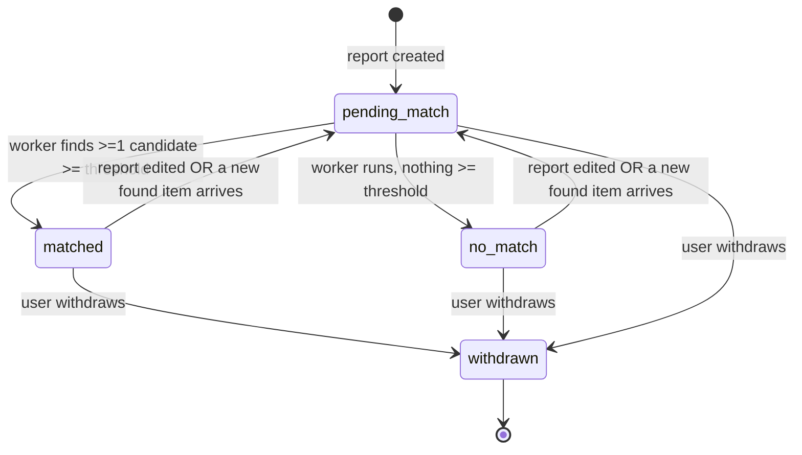
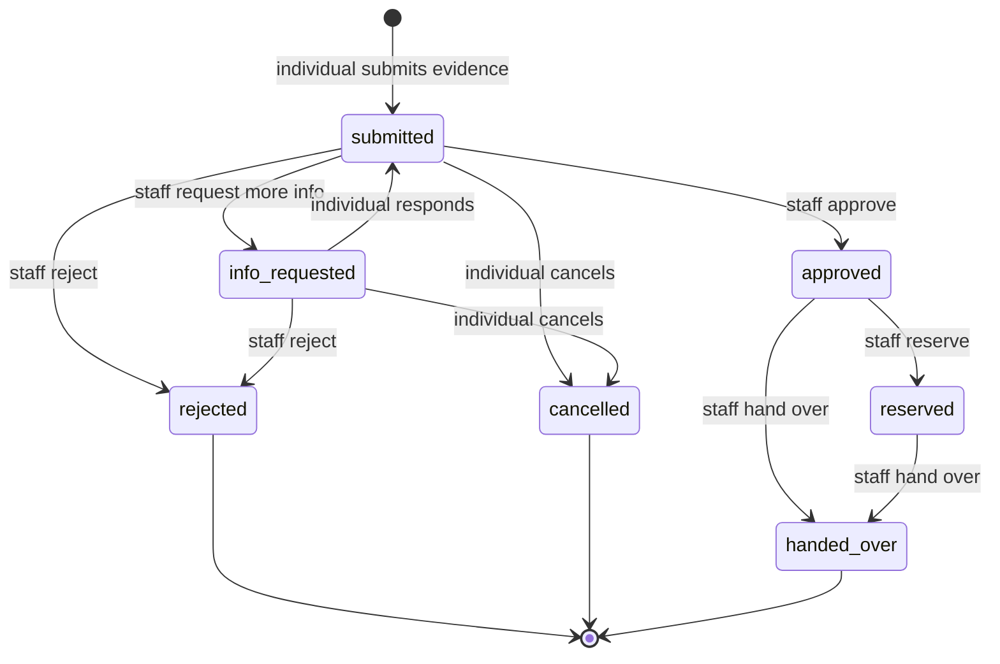
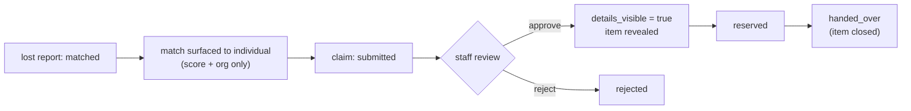

# Flow: Decision & Status Lifecycle

The two state machines that drive LostLink and the privacy gate between them: the **lost
report status** (set by matching) and the **claim** (7 states, driven by staff/individual
actions). This is where "decisions change state."

Related: [`matching.md`](matching.md) (how a status is decided),
[`organisation-access.md`](organisation-access.md) (who may act). Rationale: `../RATIONALE.md`
ADR-022 (claim state machine), ADR for report-status lifecycle.

---

## 1. Lost-report status (set by the worker)



| Status | Meaning | UI label |
|--------|---------|----------|
| `pending_match` | created; worker hasn't finished yet | "searching…" |
| `matched` | ≥1 found item cleared the threshold | "match found" (green) |
| `no_match` | worker ran, nothing cleared **yet** | "no match yet" |
| `withdrawn` | user withdrew the report | "withdrawn" |

- `no_match` is **not** permanent — a later found item can flip it to `matched`.
- Editing a matching input sets the report to `pending_match` and queues re-scoring.
  Description changes clear the text embedding; location, time and photo-only changes reuse
  it. An unchanged save does not enqueue unnecessary matching work.
- Constants: `backend/pipeline/models.py` (`STATUS_*`, `INACTIVE_STATUSES`).

Found items have their own status driven by claims, not matching:
`available` → `reserved` → `closed` (plus `withdrawn`).

---

## 2. Claim state machine (7 states)

A claim exists only **after** a report is `matched` and the individual acts on a surfaced
match (you can't claim an item that was never shown to you). Both sides validate every
transition through the shared machine (`backend/api/claim_state.py`), so no invalid change
is possible from either side.



The transition table, straight from `claim_state.py` (`action → from-states → result,
actor`):

| Action | Allowed from | Result | Actor |
|--------|--------------|--------|-------|
| `respond` | `info_requested` | `submitted` | individual |
| `cancel` | `submitted`, `info_requested` | `cancelled` | individual |
| `request_info` | `submitted` | `info_requested` | staff |
| `approve` | `submitted` | `approved` | staff |
| `reject` | `submitted`, `info_requested` | `rejected` | staff |
| `reserve` | `approved` | `reserved` | staff |
| `hand_over` | `approved`, `reserved` | `handed_over` | staff |

Terminal states: `rejected`, `cancelled`, `handed_over`.

The found item moves alongside the claim: `available` → `reserved` (on `reserve`) →
`closed` (on `hand_over`). Reserve and hand-over update the claim and item atomically with
a DynamoDB transaction, so a Lambda failure cannot leave their lifecycle states out of
sync. Withdrawing a found item rejects active claims and notifies the claimants.

---

## 3. The privacy gate (the core promise)

Found-item details are hidden from the claimant until ownership is verified. One function
is the single source of truth, applied to every claimant-facing response:

```python
# claim_state.py
def details_visible(state):
    return state in {approved, reserved, handed_over}
```

- Before approval (`submitted` / `info_requested`): the claimant sees only that a partner
  organisation may hold their item, the organisation name, and the confidence score. **No
  description, no photo, no exact location.**
- At `approved` onward: the item's description, location and photo are revealed, with
  collection instructions.
- Staff always see full evidence and the item — the claim is against their own org.

Because it's enforced server-side (not just hidden in the UI), the gate holds even if a
client is tampered with.

## 4. Conversation and evidence details

Claim cards are summaries; opening **View claim** fetches the authorised detail endpoint
and shows the original evidence, chronological messages, and attachments. Staff questions
must be non-blank. A claimant reply must contain text or at least one valid attachment and
returns `info_requested` to `submitted`.

Evidence uploads go directly from the browser to the private photos bucket using a
short-lived presigned POST policy. The policy and final claim association both enforce
the type/size limits: JPEG, PNG, WebP or PDF; at most five files per submission/reply,
10 MiB per file and twenty files per claim. Upload keys are namespaced to the claimant,
and the API verifies ownership and S3 metadata before association. Detail endpoints sign
only keys already attached to that authorised claim; there is no general-purpose "sign
this S3 key" endpoint.

Claims carry a `revision`. State/message updates condition on both the expected state and
revision, returning 409 on a concurrent change so the UI can refresh without discarding
the unsent draft.

---

## 5. How the two machines connect



The report status answers "is there anything for me?"; the claim answers "is this specific
item mine, and can I collect it?".

---

## 6. Status → UI

- Report badge: `pending_match` → "searching…", `matched` → "match found" (green),
  `no_match` → "no match yet", `withdrawn`.
- Found-item badge: `available` / `reserved` / `closed` / `withdrawn`.
- Claim badge: the 7 states, on both the individual's "My claims" and staff "Ownership
  claims" lists. Labels: `frontend/src/labels.ts`.
- No live polling — a refresh reflects the latest worker-set status and new matches.

---

## 7. Files

| Concern | File |
|---------|------|
| Report status constants + sets | `backend/pipeline/models.py` |
| Report status set by matching | `backend/pipeline/worker.py` |
| Report status on create/edit/withdraw | `backend/api/reports_handler.py` |
| Claim transitions + privacy gate | `backend/api/claim_state.py` |
| Claim handlers (individual + staff) | `backend/api/claims_handler.py`, `staff_handler.py` |
| UI labels/badges | `frontend/src/labels.ts`, `styles.css` |

---

## 8. How to change it

- **Add a claim state / transition**: add the constant + a row in `TRANSITIONS`
  (`claim_state.py`); the handlers and UI labels follow. Keep each transition's `actor`
  correct so only the right side can perform it.
- **Change what's revealed when**: edit `details_visible` (`claim_state.py`) — the single
  gate. Don't scatter visibility logic into handlers.
- **Add a report status**: add to `models.py`; update the worker and
  `reports_handler.py`; add a label in `labels.ts`.

## 9. Verify

```bash
wsl -d Ubuntu bash ~/ComputeOnClouds/scripts/verify_status_lifecycle.sh    # matched / no_match
wsl -d Ubuntu bash ~/ComputeOnClouds/scripts/verify_claims_individual.sh   # submit + privacy gate hides details
wsl -d Ubuntu bash ~/ComputeOnClouds/scripts/verify_claims_staff.sh        # approve -> reserve -> handover; withdrawal
```
