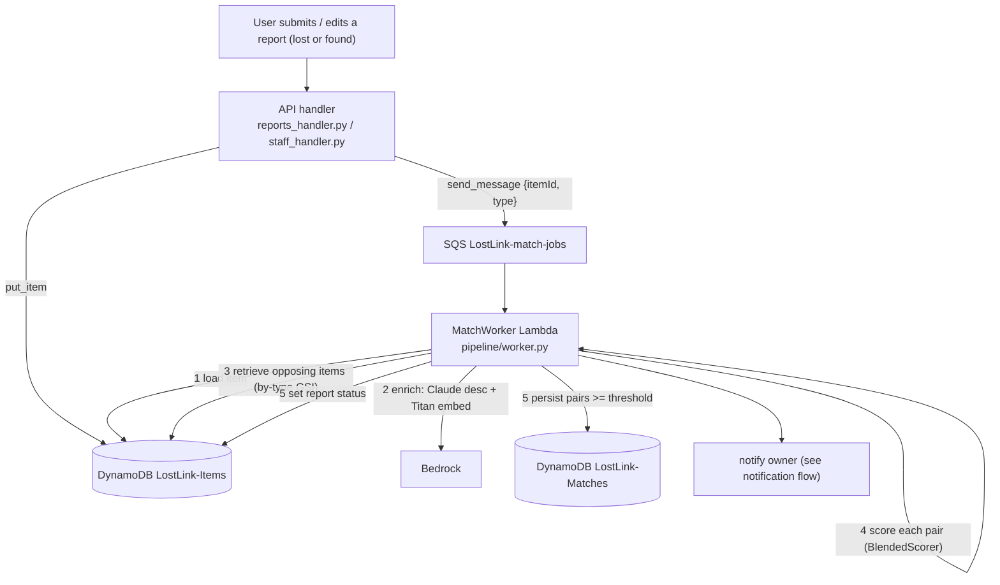

# Flow: Matching

How a lost report is matched against found items: the async flow, the swappable pipeline
stages, the exact scoring math, and **how to change each piece**.

Related: [`decision-and-status.md`](decision-and-status.md) (how the score sets the report
status), [`notification.md`](notification.md) (emailing the owner on a match). Rationale:
`../RATIONALE.md` ADR-003/004/005/006.

---

## 1. The big picture — async and event-driven

Submitting a report does not search anything inline. It writes the item and drops a job on
a queue; a worker Lambda does the matching.



Why async: embedding + Claude calls take seconds and matching is cross-org; doing it
inline would make submit slow and fragile. The queue gives free retries and a dead-letter
queue for poison messages.

**Matching is symmetric.** A job runs whether a *lost* or a *found* item was submitted. A
new found item re-scans existing lost reports and can flip an old `no_match` to `matched` —
no resubmission needed.

---

## 2. The pipeline is a set of swappable stages

The worker depends only on **abstract interfaces**; a `factory` picks each implementation
from environment variables. This is how matching logic changes without touching
orchestration.

| Stage (interface) | Default impl | Env var | File |
|-------------------|--------------|---------|------|
| `DescriptionSource` | `ClaudeDescriptionSource` | `DESCRIPTION_SOURCE` | `backend/pipeline/impl/description.py` |
| `Embedder` | `TitanEmbedder` | `EMBEDDER` | `backend/pipeline/impl/embedder.py` |
| `CandidateRetriever` | `BruteForceRetriever` | `RETRIEVER` (`bruteforce`\|`ann`) | `backend/pipeline/impl/retriever.py` |
| `Scorer` | `BlendedScorer` | `SCORER` | `backend/pipeline/impl/scorer.py` |
| `ProfileSelector` | `DefaultProfileSelector` | `PROFILE_SELECTOR` | `backend/pipeline/impl/profile.py` |
| `Notifier` | `SesNotifier` | `NOTIFIER` | `backend/pipeline/impl/notifier.py` |
| `ItemRepository` | `DynamoItemRepository` | `REPOSITORY` | `backend/pipeline/impl/repository.py` |

- Interfaces: `backend/pipeline/interfaces.py` · Wiring: `backend/pipeline/factory.py` ·
  Orchestration: `backend/pipeline/worker.py` · Data types: `backend/pipeline/models.py`

New implementation of any stage = write a class implementing the interface, add a branch in
`factory.make_*`, set the env var. Nothing else changes.

---

## 3. What the worker does (`MatchWorker.handle(job)`)

Job: `{"itemId": "...", "type": "lost" | "found"}`.

1. **Load** the item. Deleted between enqueue and processing → skip (no crash/DLQ).
   Status in `INACTIVE_STATUSES` (`withdrawn`, `reserved`, `closed`) → skip.
2. **Enrich** (`_ensure_enriched`): no description but a photo → Claude writes one; then
   Titan embeds. Both cached back to the item row (paid once).
3. **Retrieve** opposing-type candidates across every org (lost → all `found`; found →
   all `lost`) via the `by-type` GSI.
4. **Score** each candidate with the active profile's weights + threshold. Inactive or
   not-yet-embedded candidates are skipped.
5. **Persist + react**: each pair `>= threshold` → a row in `LostLink-Matches`, notify
   the owner (deduped), mark the lost report `matched`. After the loop the triggering
   lost report is set `matched` (≥1) or `no_match` (0). Found items keep their
   staff/claims status.

Edits are revision-aware. Description changes clear the text vector; location/time/photo
changes reuse it. Relevant edits still enqueue a new match job. The worker conditions
derived writes on the revision it loaded, marks obsolete match rows inactive, and
reactivates qualifying pairs without resetting notification-dedup history. A stale queued
job therefore cannot overwrite a newer edit or withdrawal.

Photo-generated descriptions record their source photo and generation time. Explicit
preview generation runs in the authenticated `descriptions_handler` Lambda and remains
separate from saving; only accepted or edited text is embedded. The UI disclosure is
the deterministic literal `may be generated using Gen AI.` and never enters stored
descriptions or model prompts. Request identifiers deduplicate preview calls; their sparse
marker records expire from the Items table after 24 hours through DynamoDB TTL.

---

## 4. The scoring math

File: `backend/pipeline/impl/scorer.py`. Pure function (no AWS/IO) — the eval harness and
`scripts/score_debug.py` call it directly.

```
score = w_text·textSim + w_image·imageSim + w_location·spatialSim + w_time·temporalSim
```
normalised over the components present (a missing component drops its weight from the
denominator; score stays in 0–1).

- **textSim / imageSim** — cosine similarity remapped `[-1,1] → [0,1]` via `(cos+1)/2`.
  Image is 0 today (`w_image = 0`).
- **spatialSim** (`_spatial`) — when both items have WGS84 points, Haversine distance
  feeds `0.5 ** (distance_metres / half_distance_metres)` (default 500 m, configured by
  `LOCATION_HALF_DISTANCE_METRES`). Otherwise legacy zones score `1.0` on equality,
  else `0.1`; absent comparable locations omit the term. See [location.md](location.md)
  for autocomplete, storage, explicit radius filtering and compatibility.
- **temporalSim** (`_temporal`) — `0.5 ** (hours / 72)`; `1.0` at the same instant.

Defaults (`infra/lib/config.ts`): text `0.6`, image `0.0`, location `0.25`, time `0.15`;
**threshold `0.7`**.

Worked example — the dummy "wallet / central library" vs the found wallet:
```
text 0.733, location 0.100 (zones differ), time 1.000
0.6·0.733 + 0.25·0.100 + 0.15·1.000 = 0.615  -> below 0.7  (no_match)
```
If zones matched: `0.6·0.733 + 0.25·1.0 + 0.15·1.0 = 0.84` → match.

Inspect live pairs:
```bash
wsl -d Ubuntu bash ~/ComputeOnClouds/scripts/score_debug.sh
```

---

## 5. Candidate retrieval

`backend/pipeline/impl/retriever.py` + `repository.py:list_candidates`.

- `BruteForceRetriever` loads **all** opposing-type items; the Scorer scores each. Exact,
  fine at prototype scale. DynamoDB does no similarity ranking — it is just the store.
- Before scoring, the worker applies any explicit radius on the lost report, in both
  job orientations. Unknown coordinates cannot pass a strict radius. No radius keeps
  proximity as a ranking signal.
- Cross-org retrieval queries the `by-type` GSI, paginates, drops the query item itself.
- `AnnRetriever` is a documented scaling stub (vector index → coarse top-K → Scorer
  re-ranks). Selectable via `RETRIEVER=ann` once built (ADR-006).

Retrieval decides *which* candidates; the Scorer decides *how* they rank — swapping one
never affects the other.

---

## 6. How to change matching — recipes

- **Weights / threshold** (most common): edit `infra/lib/config.ts`
  (`weight*`, `threshold`), redeploy `LostLink-Matching`. Injected as `WEIGHT_*` /
  `MATCH_THRESHOLD`, read by `DefaultProfileSelector`. No code change.
- **Fix zone matching** (`central library` vs `central-lib`): edit `_spatial` in
  `scorer.py` — normalise strings (lowercase/strip/collapse separators; won't equate
  `library`≈`lib`), or give partial credit on substring, or best: make location a shared
  **dropdown** so both sides emit identical values.
- **New formula**: edit `BlendedScorer.score` or add a `Scorer` + `factory.make_scorer`
  branch + `SCORER=<name>`. Contract: pure, deterministic, returns a `MatchResult` with a
  `breakdown`.
- **Enable image matching**: populate `VectorMap.image` in the embedder, raise
  `weightImage`. The scorer already blends an image term when both items have one.
- **Scale retrieval**: implement `AnnRetriever.retrieve`, set `RETRIEVER=ann`.
- **Confidence profile** (e.g. stricter with a photo): branch in
  `DefaultProfileSelector.select` or add a `ProfileSelector` + `PROFILE_SELECTOR`.

---

## 7. Verify

```bash
cd backend && . .venv/bin/activate && python3 -m pytest -q    # scorer/worker/retriever/status
cd eval && python3 -m pytest -q                               # scoring sweep
wsl -d Ubuntu bash ~/ComputeOnClouds/scripts/score_debug.sh            # live breakdown
wsl -d Ubuntu bash ~/ComputeOnClouds/scripts/verify_matching.sh        # text match persisted
wsl -d Ubuntu bash ~/ComputeOnClouds/scripts/verify_photo_match.sh     # photo -> desc -> match
wsl -d Ubuntu bash ~/ComputeOnClouds/scripts/verify_status_lifecycle.sh# matched / no_match
wsl -d Ubuntu bash ~/ComputeOnClouds/scripts/rematch_all.sh            # re-score all after a change
```

Weight/threshold changes affect only **new** scoring runs; `rematch_all.sh` re-enqueues
every current item so existing reports pick up the new rules.
