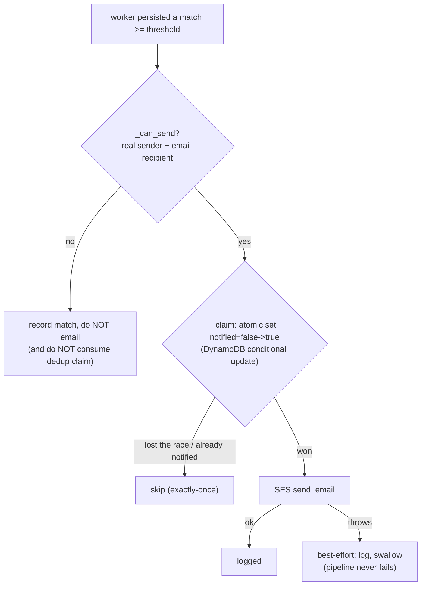

# Flow: Notification

How LostLink tells people things happened — a potential match was found, or a claim
changed state — without ever coupling delivery to the core data path.

Related: [`matching.md`](matching.md) (what triggers a match email),
[`decision-and-status.md`](decision-and-status.md) (claim-decision emails). Rationale:
`../RATIONALE.md` ADR-021 (dedup), ADR-023 (best-effort/decoupled).

---

## 1. Two kinds of notification

- **Match notification** — when the worker persists a *new* above-threshold match, it
  emails the lost-report owner: "a partner organisation may be holding your item." Details
  stay hidden (privacy gate); the email just invites them to start a claim.
- **Claim-decision notification** — when staff act on a claim (request info, approve,
  reject) or withdraw a found item, the affected party is emailed.

Channel is Amazon SES, hidden behind the `Notifier` interface
(`backend/pipeline/impl/notifier.py` for matches; the claims handler sends claim emails).

---

## 2. Match notification: three gates in order



### Gate 1 — `_can_send`
Returns false (and sends nothing) if there's no real verified sender (missing or a
`.example` address) or the recipient isn't an email. Crucially it does **not** consume the
dedup claim, so the email can still go out later once a real sender is configured.

### Gate 2 — `_claim` (exactly-once dedup)
Deduplication rides on the Matches row with an atomic DynamoDB conditional update:

```python
update_item(
  Key={queryItemId, candidateItemId},
  UpdateExpression="SET notified = :t",
  ConditionExpression="attribute_not_exists(notified) OR notified = :f",
  ... :t=True, :f=False)
```
Only the caller that flips `notified` false→true sends. So even if the SQS worker
reprocesses the message (redelivery, DLQ retry, or both a lost and a found job touching the
same pair), the owner is emailed **once per report-item pair**.

### Gate 3 — best-effort send
The `send_email` call is wrapped in try/except. A failure (e.g. SES sandbox rejecting an
unverified recipient) is logged and swallowed — it must **never** fail the matching
pipeline or roll back the match. Notification is strictly downstream of persistence.

---

## 3. Why decoupled

Earlier, claim-then-send-always with a placeholder sender crashed the worker and pushed
messages to the DLQ (ADR-023). The fix: the match is persisted regardless; sending is a
separate, failure-isolated step. The data is always correct even when email isn't
possible.

---

## 4. SES sandbox note

The verified sender is `satpathy.amrit@u.nus.edu`; in the SES **sandbox**, recipients must
also be verified, so arbitrary addresses won't receive match/claim emails until the account
leaves the sandbox (or the recipient is verified). This is independent of the **Cognito**
sign-up verification code, which Cognito sends via its own built-in email sender — so
registration still works for any address (see [`authentication.md`](authentication.md)).

---

## 5. Files

| Concern | File |
|---------|------|
| Match email + dedup + best-effort send | `backend/pipeline/impl/notifier.py` |
| Notifier interface | `backend/pipeline/interfaces.py` (`Notifier`) |
| Claim-decision emails | `backend/api/claims_handler.py`, `staff_handler.py` |
| Sender / app URL config | `infra/lib/config.ts` (`senderEmail`), matching + api stacks (`SENDER_EMAIL`, `CLOUDFRONT_URL`) |

---

## 6. How to change it

- **Switch channel** (SMS, push, SNS fan-out): implement a new `Notifier`, register it in
  `factory.make_notifier`, set `NOTIFIER=<name>`. The worker is untouched.
- **Change the email copy / add the app link**: edit the `subject`/`body` in
  `notifier.py` (`CLOUDFRONT_URL` is already linked when set).
- **Change the sender**: `SENDER_EMAIL` (config/stack env), must be a verified SES
  identity; redeploy the matching + api stacks.
- **Leave the SES sandbox**: request production access in SES, then any recipient can be
  emailed.

## 7. Verify

```bash
wsl -d Ubuntu bash ~/ComputeOnClouds/scripts/verify_notify.sh       # dedup = exactly-once
wsl -d Ubuntu bash ~/ComputeOnClouds/scripts/verify_email_live.sh   # REAL send (needs verified sender+recipient)
```
