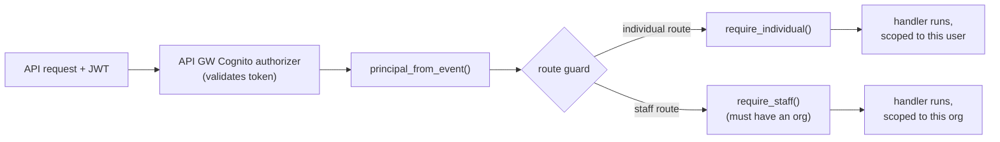

# Flow: Organisation & Access Control

What a role and an organisation are, and exactly what each is allowed to see and do. This
is the product's privacy core: cross-organisation matching **without** leaking one
organisation's inventory to another, or to claimants, until ownership is verified.

Related: [`authentication.md`](authentication.md) (where role/org come from),
[`decision-and-status.md`](decision-and-status.md) (the per-claim privacy gate).

---

## 1. The model

- **Role** = Cognito **group membership**: `Individual` or `Staff`. It arrives in the JWT
  as `cognito:groups`. There is no `custom:role` attribute — the group *is* the role.
- **Organisation** = the `custom:organisationId` claim. Staff carry one; individuals do
  not.

So three identity shapes exist:

| Identity | groups | organisationId |
|----------|--------|----------------|
| Individual | `[Individual]` | — |
| Staff (org A) | `[Staff]` | `org-a` |
| Staff (org B) | `[Staff]` | `org-b` |

---

## 2. The enforcement point

Every handler builds a `Principal` from **validated JWT claims only**
(`backend/api/auth.py`). Role and org are *never* read from the request body — a caller
cannot claim to be staff or a different org by editing a payload.

```python
# auth.py (essence)
class Principal:
    user_id; email; groups; organisation_id
    is_individual = "Individual" in groups
    is_staff      = "Staff" in groups
    def require_individual(): 403 unless is_individual
    def require_staff():      403 unless is_staff and organisation_id present
```

Each route calls the matching guard first:



`require_staff()` additionally fails if the staff token has no organisation — a staff
member must always be bound to an org to act.

---

## 3. The organisation boundary is also in the data model

Access scoping is not only in code — it is baked into the DynamoDB key design
(`infra/lib/data-stack.ts`), so org-scoped queries can't accidentally cross orgs:

- **`by-owner` GSI** (PK `ownerId`) — an individual lists only their own reports.
- **`by-org-type` GSI** (PK `<orgId>#<itemType>`) — staff list/search only their own
  org's inventory. The org id is part of the key, read from the JWT.
- **`by-type` GSI** (PK `itemType`) — used **only** by the matching worker for
  cross-org candidate retrieval. Matching deliberately spans all orgs; the results are
  then privacy-gated per claim (see below).

So matching is cross-org, but *browsing* is not: no API lets staff in org A read org B's
items or claims (403).

---

## 4. Who sees what

| | Individual | Staff (own org) | Staff (other org) |
|--|------------|-----------------|-------------------|
| Own lost reports + status | ✓ | — | — |
| Found items / inventory | hidden until a claim is approved | ✓ (own org) | ✗ (403) |
| Potential matches | ✓ (confidence score + org name only) | — | — |
| Claim evidence | own claims only | ✓ (claims against own org) | ✗ (403) |
| Match / claim emails | ✓ (to the individual) | — | — |

The "hidden until approved" cell is enforced per request by `details_visible()` — see
[`decision-and-status.md`](decision-and-status.md) §privacy gate.

---

## 5. Files

| Concern | File |
|---------|------|
| Principal + guards (`require_individual/staff`) | `backend/api/auth.py` |
| Individual-scoped routes | `backend/api/reports_handler.py`, `claims_handler.py` |
| Org-scoped routes | `backend/api/staff_handler.py`, `claims_handler.py` (staff) |
| Key design / GSIs enforcing the boundary | `infra/lib/data-stack.ts`, `backend/pipeline/impl/repository.py` |
| JWT authorizer binding | `infra/lib/api-stack.ts` |

---

## 6. How to change it

- **Add a new role** (e.g. `Admin`): add the Cognito group (`auth-stack.ts`), add an
  `is_admin` / `require_admin` on `Principal` (`auth.py`), and guard the new routes.
- **Support multi-org staff**: today `custom:organisationId` is a single value; a staff
  member belongs to one org. Supporting several would mean a different claim shape and
  revisiting the `by-org-type` key.
- **Tighten CORS / origins**: `infra/lib/api-stack.ts` (`corsPreflight.allowOrigins`).

## 7. Verify

```bash
wsl -d Ubuntu bash ~/ComputeOnClouds/scripts/verify_api_staff.sh   # org boundary + roles (403s)
wsl -d Ubuntu bash ~/ComputeOnClouds/scripts/verify_api_reports.sh # individual ownership
```
